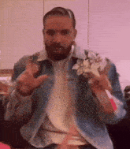
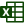

  

  
  

  <picture>
      <source
        media="(prefers-color-scheme: dark)"
        srcset="https://readme-typing-svg.demolab.com?font=Arial&weight=900&size=24&duration=2000&pause=3000&color=FFFFFF&center=true&vCenter=true&width=280&height=24&lines=I'm+an+economics+student"
      />
      <source
        media="(prefers-color-scheme: light), (prefers-color-scheme: no-preference)"
        srcset="https://readme-typing-svg.demolab.com?font=Arial&weight=900&size=24&duration=2000&pause=3000&color=000000&center=true&vCenter=true&width=280&height=24&lines=I'm+an+economics+student"
      />
      
  </picture> 
  

  <picture>
      <source
        media="(prefers-color-scheme: dark)"
        srcset="https://readme-typing-svg.demolab.com?font=Arial&weight=900&size=24&duration=1800&pause=3000&color=FFFFFF&center=true&vCenter=true&width=180&height=24&lines=I+play+Basketball"
      />
      <source
        media="(prefers-color-scheme: light), (prefers-color-scheme: no-preference)"
        srcset="https://readme-typing-svg.demolab.com?font=Arial&weight=900&size=24&duration=1800&pause=3000&color=000000&center=true&vCenter=true&width=180&height=24&lines=I+play+Basketball"
      />
      
  </picture> 

  <picture>
      <source
        media="(prefers-color-scheme: dark)"
        srcset="https://readme-typing-svg.demolab.com?font=Arial&weight=900&size=24&duration=2000&pause=3000&color=FFFFFF&center=true&vCenter=true&width=250&height=24&lines=I'm+a+big+fan+of+Dranke"
      />
      <source
        media="(prefers-color-scheme: light), (prefers-color-scheme: no-preference)"
        srcset="https://readme-typing-svg.demolab.com?font=Arial&weight=900&size=24&duration=2000&pause=3000&color=000000&center=true&vCenter=true&width=250&height=24&lines=I'm+a+big+fan+of+Dranke"
      />
      
  </picture> 
  

     <picture>
    <source
      media="(prefers-color-scheme: dark)"
      srcset="https://readme-typing-svg.demolab.com?font=Arial&weight=900&size=24&duration=1200&pause=2000&color=FFFFFF&center=true&vCenter=true&width=140&height=24&lines=I+operate+in"
    />
    <source
      media="(prefers-color-scheme: light), (prefers-color-scheme: no-preference)"
      srcset="https://readme-typing-svg.demolab.com?font=Arial&weight=900&size=24&duration=1200&pause=2000&color=000000&center=true&vCenter=true&width=140&height=24&lines=I+operate+in"
    />
    
</picture>  
   Word,
   Excel,
   PowerPoint,
   OpenAI,
   Vercel,
   Node.js,  
   MySQL, 
   Python,
   Java,
   TypeScript,
   C++, and
   CSS

  <h3 align="left" >Daily Quote</h3>
  <picture>
      <source
        media="(prefers-color-scheme: dark)"
        srcset="https://readme-daily-quotes.vercel.app/api?accent_color=0F4605FF&quote_color=FFFFFF&border_width=0&author_color=FFFFF"
      />
      <source
        media="(prefers-color-scheme: light), (prefers-color-scheme: no-preference)"
        srcset="https://readme-daily-quotes.vercel.app/api?accent_color=0F4605FF&quote_color=000000&bg_color=FFFFFF&border_width=0&author_color=000000"
      />
      
  </picture> 
   
  <h3 align="right" >Please and Thank You</h3>

